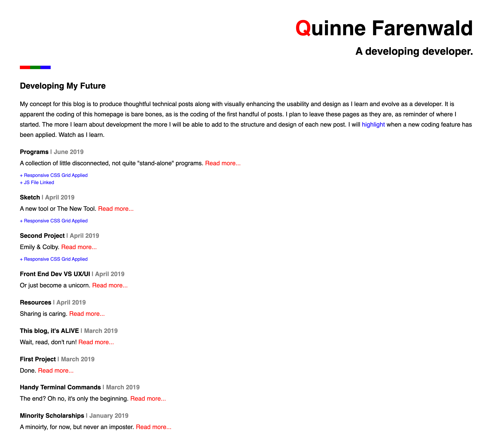
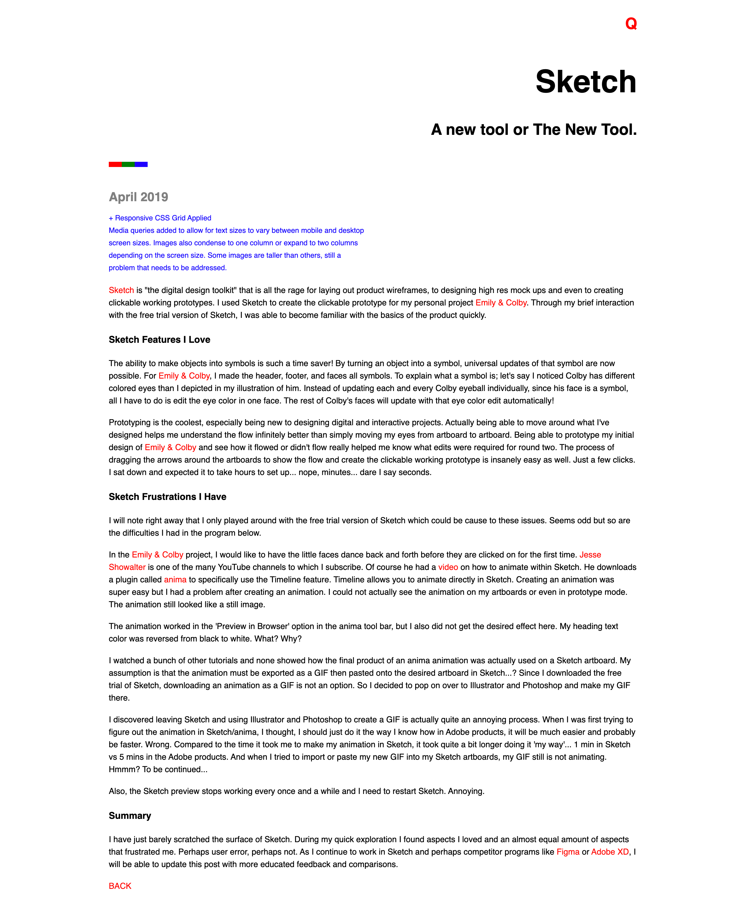
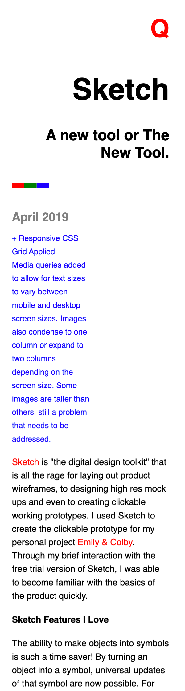

# Developing Developer

My concept for this blog is to produce thoughtful technical posts along with visually enhancing the usability and design as I learn and evolve as a developer. It is apparent the coding of this homepage is bare bones, as is the coding of the first handful of posts. I plan to leave these pages as they are, as reminder of where I started. The more I learn about development the more I will be able to add to the structure and design of each new post. I will highlight when a new coding feature has been applied. Watch as I learn.

### Focuses

- Build upon developing and design techniques as I learn.

- Articulate both technical and non technical challenges that arise in my journey.

### Screenshots

Homepage
- The homepage will remain how I originally created the blog, with HTML and CSS... just the basic building blocks.

Post Desktop
- As shown in the blue text associated with each blog, as I learn, I will add features to each new blog post. Here I added a max width media query for the desktop view.

Post Mobile
- This is the same post and also includes media queries for a better mobile view.

### Tech

- Utilizes the basic building blocks of HTML and CSS.

- Will add new tech as I learn, like media queries and JavaScript.

### Team (Solo)

- Quinne Farenwald (https://github.com/qfarenwald)
